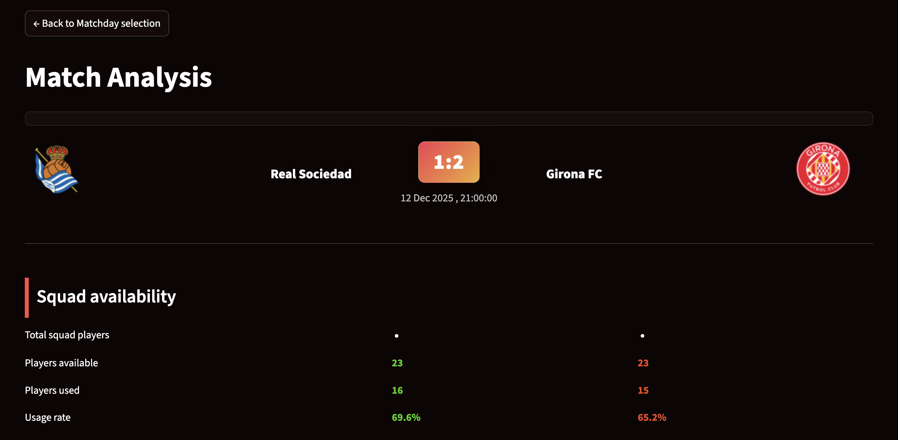

# Match Analysis

The Match Analysis dashboard provides a detailed, side by side breakdown of two teams involved in a specific La Liga fixture, focusing on how squad composition and availability relate to the match outcome.

This view is designed for deeper inspection after identifying an interesting fixture from the Matchday Overview.

## Description

This dashboard is exploratory rather than predictive.
Differences in squad metrics highlight structural contrasts between teams, but they do not imply causality.

Market value data originates from Transfermarkt and reflects estimated valuations, which may be influenced by reputation effects, timing of updates and incomplete injury reporting.

For a selected match, the dashboard presents:

* Home and away team comparison in a symmetric layout
* Squad size, average age and market value indicators
* Player availability and utilization metrics
* Match result context alongside squad level characteristics

All metrics are computed from the match specific squads used on that day, not season averages.

## Key interactions

The Match Analysis view complements the Matchday Overview by enabling match level storytelling, making it possible to connect squad efficiency patterns to individual game outcomes.

Users can:

* Select a specific match from the dataset
* Compare squad efficiency indicators between home and away teams
* Observe imbalances in experience, depth, market value
* Relate squad characteristics to the final match result

Navigation back to the Matchday Overview allows users to seamlessly explore multiple fixtures.

---
Return to [Main page](index.md)