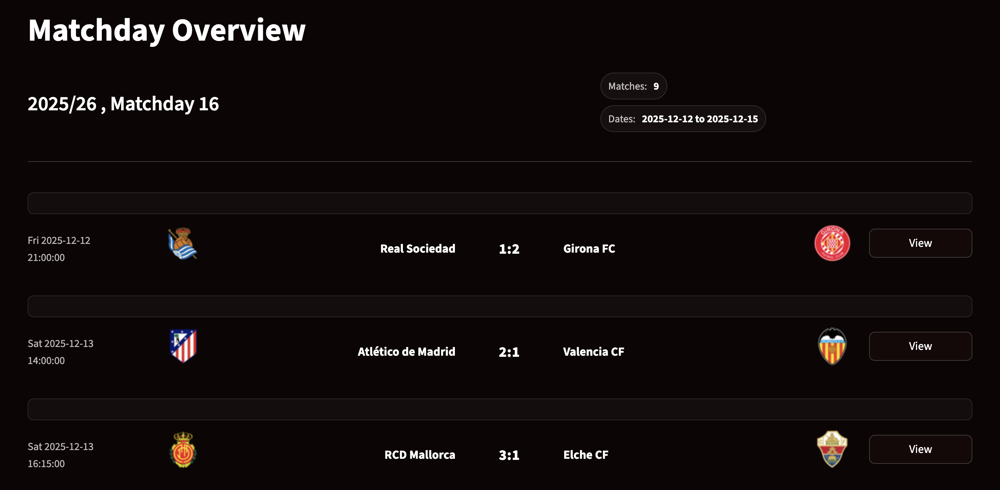

# Matchday Overview

The Matchday Overview dashboard provides a high level snapshot of all fixtures played on a selected La Liga matchday, focusing on how squad characteristics relate to match outcomes.

This page is designed for fast comparison across multiple matches, allowing users to identify patterns before drilling down into individual games.

## Description

High-level view of all fixtures for a selected matchday, allowing quick comparison of squad metrics across teams.

For each match in the selected matchday, the dashboard displays competing teams with club identity and match result.
Each match is presented in a compact visual container so that several fixtures can be scanned at once without losing readability.

## Key interactions

This dashboard is best used as a filtering and orientation tool before moving to match level analysis, where individual team compositions and dynamics can be examined in more detail.

Users can:

* Select a specific matchday from the season
* Quickly identify matches of interest based on squad imbalance or unexpected results
* Navigate directly to the Match Analysis view for deeper inspection of a single fixture

The Matchday Overview acts as the main entry point to the dashboard workflow.

---
Return to [Main page](index.md)